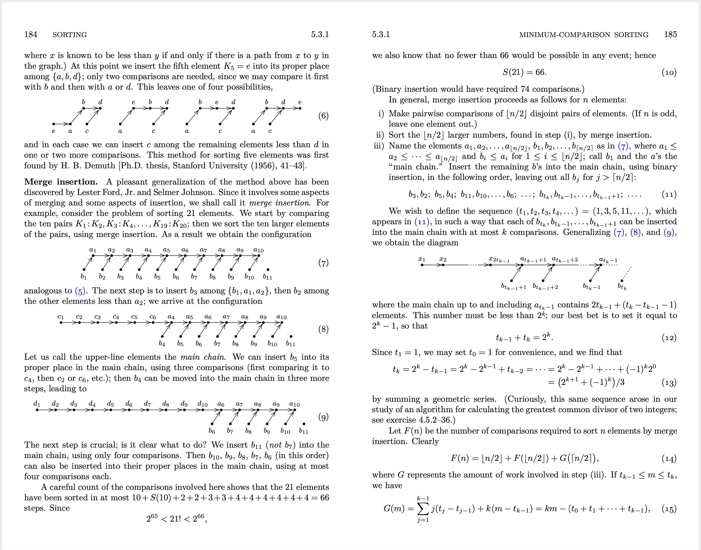
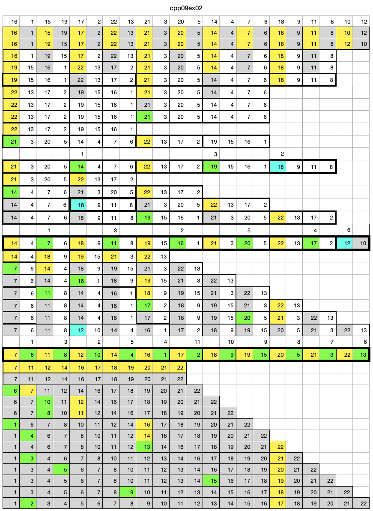
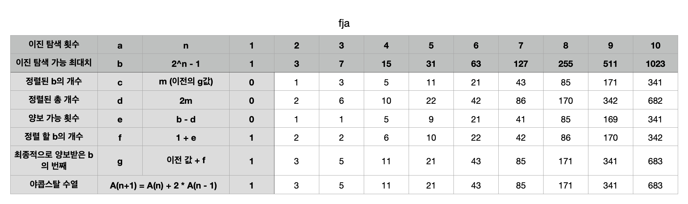
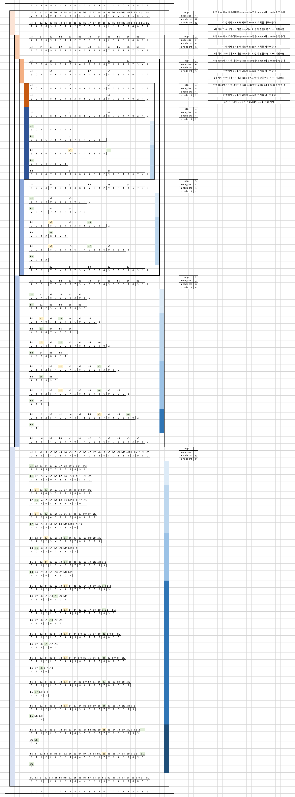

# Ford-Johnson Algorithm

cpp 학습을 위한 단계적 과제 중 가장 마지막 과제에서 구현해야하는 알고리즘이다.

`merge-insertion sort`라고도 불린다.

### 자료

관련된 자료를 찾기 힘들어 초창기엔 merge와 insert를 적절히 섞어 새로 만들라는 의미라고 잘못 해석한 케이스도 있었다.

[Merge-insertion_sort(위키피디아)](https://en.wikipedia.org/wiki/Merge-insertion_sort)
를 통해 기본적인 동작은 알 수 있었는데 이걸 어떻게 구현해야하는가라는 문제가 생긴다. 

솔직히 직관적으로 이해되지 않길래 직접 한땀한땀 알고리즘대로 진행한 후 비교하거나 삽입할 때의 숫자를 기준으로 시각적으로 표기해봤다.

맨 밑의 노란색이 a, 초록색이 b이다. 그렇다. 탐색해야하는 개수가 일정했다.

결국 이진탐색의 최대횟수에 맞춰서 최대한 탐색 횟수를 적게 유지하는 알고리즘이었다.

임의의 탐색 횟수를 기반으로 이진탐색 가능한 최대치를 유지하는 경우 야콥스탈 수열과 같은 수가 나오는 것임을 깨닫고 명확하게 하기 위해 표를 기반으로 정리했다.

반복문을 돌리건 재귀를 돌리건 알아보기 쉽도록 더 크고 시각적으로 깊이가 나누어질 수 있되 그 상황에서 깊이에 따라 달라지는 값이 뭔지 설명하는 자료를 만들어 발표도 했다.

이건 내가 과제 하면서 넣은 특정 시점에서의 a와 b에 담긴 data를 깊이에 따라 분석해서 표기해주는 테스트용 함수를 통해 만든 로그이다.

[내가 만든 프로그램의 로그](./ecole42/fja_log.md)
